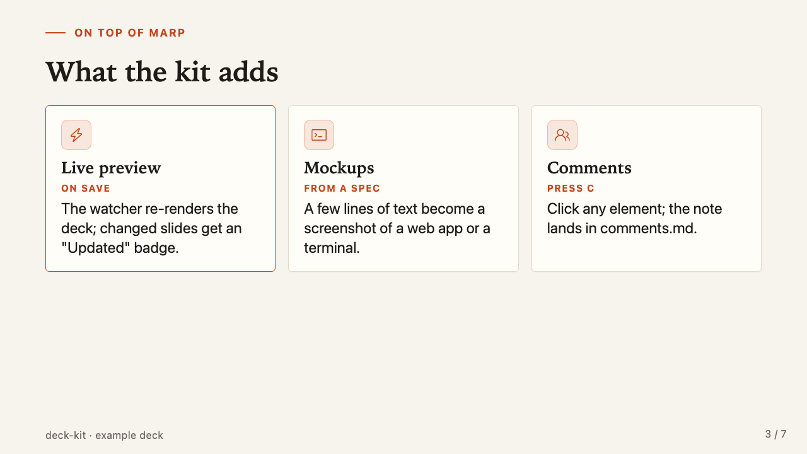
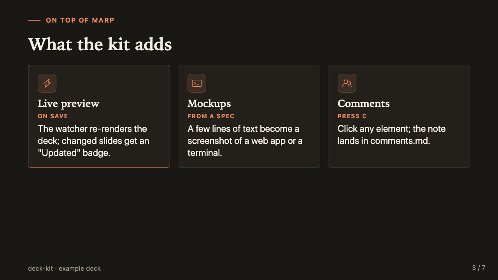
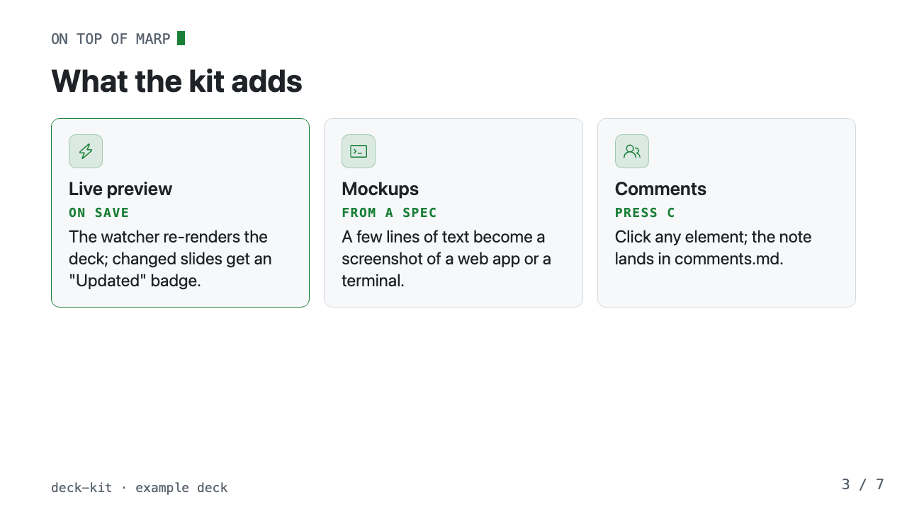
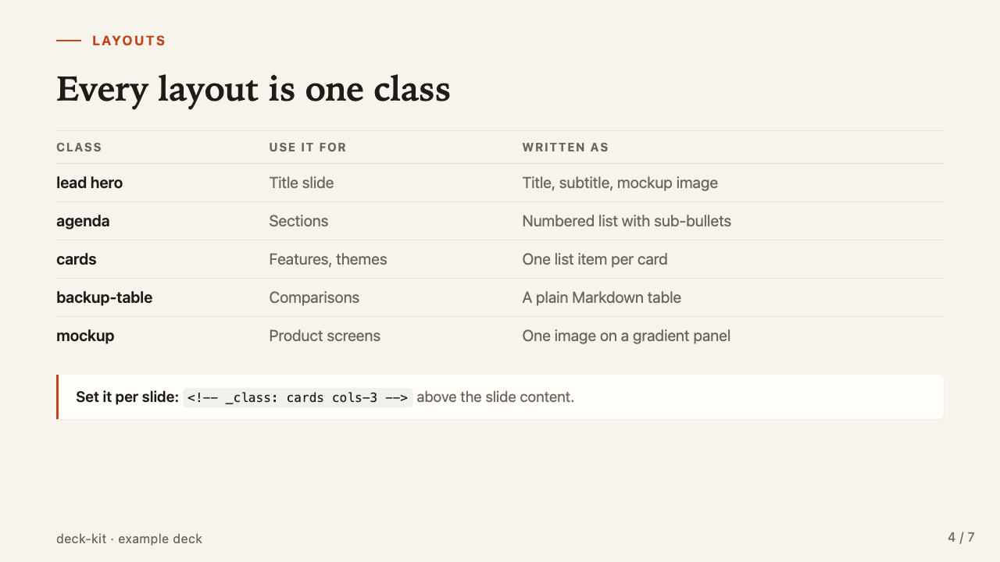
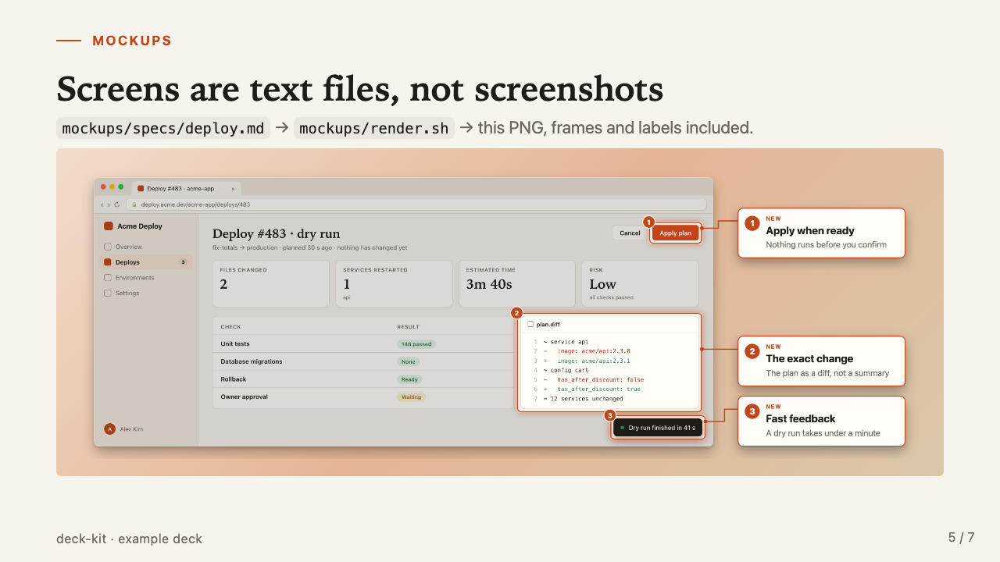

# deck-kit

A Markdown-to-slides workflow on [Marp](https://marp.app). You write `deck.md`; a background watcher re-renders it on save. On top of Marp's output it adds:

- **Change badges**: slides that changed since you last looked get an "Updated" pill.
- **Two themes with a switcher**: *paper* (default: warm, serif headlines) and *copilot* (dark terminal look), each with a dark and a light mode, plus a clean `?present` mode.
- **Comment mode**: click any element on a slide, type a note, and it lands in `comments.md`, ready to hand to an AI assistant (or a teammate).
- **Fast screenshots** of rendered slides, for quick visual checks.
- **A mockup generator**: turns a small text spec into a PNG of a CLI screen or a web app in a browser window, with optional numbered annotation frames. Each spec renders in both themes' styles, and the preview shows the one that matches.


## How it works

**1. The live deck: from Markdown to your browser**

```
  YOU WRITE                     WATCHER (./watch.sh)                  YOU SEE
 ┌──────────────────┐        ┌──────────────────────────┐        ┌──────────────────────────────┐
 │ deck.md          │  save  │ marp-cli --watch         │ writes │ deck.live.html               │
 │  slides, layout  │───────►│  + theme.css             │───────►│  (file:// in any browser)    │
 │  _class, notes   │        │  + theme-copilot.css     │        │                              │
 └──────────────────┘        │  + live-engine.js ───────┼──┐     │ Marp runtime:                │
 ┌──────────────────┐        │    renders like Marp,    │  │     │  ← → O overview  P presenter │
 │ mockups/out/*.png│        │    then appends a        │  │     │                              │
 │  (diagram 2)     │        │    <script> tag          │  └────►│ live-badges.js:              │
 └────────┬─────────┘        └──────────────────────────┘        │  "Updated" badges            │
          │   in deck.md                   │  T theme  D dark/light       │
          └──────────────────────────────────────────────────────┤  mockup swap per theme       │
                                                                 │  C comment mode ──────────┐  │
                                                                 └───────────────────────────┼──┘
                                                                           POST 127.0.0.1:8765 │
  COMMENT MODE                                                                               │
 ┌──────────────────┐        ┌───────────────────┐  appends  ┌─────────────────┐             │
 │ AI assistant or  │◄ read ─│ comments.md       │◄──────────│ comment-server  │◄────────────┘
 │ teammate         │        │ checklist: slide, │           │ .py (local only)│
 └──────────────────┘        │ element, comment  │           └─────────────────┘
                             └───────────────────┘   server down? → browser storage + clipboard
```

**2. Mockups, screenshots and exports**

```
  MOCKUPS (mockups/render.sh)
 ┌────────────────────┐    ┌───────────────────────┐    ┌──────────────┐    ┌──────────────────────┐
 │ mockups/specs/     │    │ tools/render.py       │    │ .build/*.html│    │ tools/shot.js        │
 │   start.md         │───►│ spec → cell grid →    │───►│ one per look │───►│ Playwright Chromium  │
 │   review.md        │    │ HTML, once per look:  │    │ (+ annotated,│    │ 2x, transparent PNG  │
 │ front matter +     │    │  paper   plain shell  │    │    zoom)     │    └──────────┬───────────┘
 │ user:/tool:/diff:  │    │  copilot CLI-assistant│    └──────────────┘               │
 │ + annotate: frames │    └───────────────────────┘                                   ▼
 └─────────┬──────────┘                                       mockups/out/<name>.png  (paper)
           │                                                  <name>-copilot.png      (copilot)
           │                                                  --all: -dark, -copilot-light
           │ kind: web    ┌───────────────────────┐
           └─────────────►│ tools/web.py          │───► same .build → shot.js path, same names
                          │ browser window + app  │
                          │ blocks, per look      │
                          └───────────────────────┘

  CHECKS AND EXPORTS
  deck.live.html ──► ./shot.sh 3 5 ──► Playwright ──► shots/slide-3.png   (THEME=, MODE=, OUT=)
  deck.md ─────────► ./speaker-notes.sh ────────────► speaker-notes.md    (rehearsal)
  deck.md ─────────► npm run build | pdf ───────────► deck.html | deck.pdf
                     (plain Marp, no live script; theme from the front matter)
```

| Piece | Role |
|---|---|
| `deck.md` | The only file you edit for content. Front matter picks the theme; `<!-- _class: ... -->` picks each slide's layout. |
| `theme.css`, `theme-copilot.css` | Both themes and every layout (see [Themes](#themes)). |
| `watch.sh` + `live-engine.js` | Re-render on save; inject `live-badges.js` into the live copy only. |
| `live-badges.js` | Everything interactive on top of Marp: badges, theme/mode switcher, mockup swap, comment mode, shortcuts. |
| `comment-server.py` | Local-only endpoint that turns clicks into a `comments.md` checklist. |
| `mockups/` | Text specs → PNGs of terminal screens (`render.py`) or web apps (`web.py`), in both theme styles, with optional annotation frames. |
| `shot.sh` | Fast screenshots of the rendered deck, for visual checks without opening a browser. |

## Quick start

```bash
npm install                                  # Marp CLI + Playwright (pinned)
npx playwright install chromium-headless-shell   # once, for screenshots and mockups
./watch.sh                                   # start the watcher (also: ./watch.sh status | stop)
open deck.live.html                          # or open the file in any browser
```

Edit `deck.md`, save, reload the browser tab. `deck.md` shows every layout in the theme.

Keys in `deck.live.html`:

| Key | Action |
|---|---|
| ← → Space | previous / next slide |
| O | slide overview |
| P | presenter view (notes + timer) |
| T | switch theme: paper / copilot (or open with `?theme=copilot`) |
| D | dark / light mode (or open with `?mode=dark`) |
| C | comment mode |
| Shift+M | hide / show the "Updated" badges |
| ? | all shortcuts |

Open `deck.live.html?present` to hide every helper when presenting.

## Comment mode

1. Run `python3 comment-server.py` (listens on `127.0.0.1:8765`, local only).
2. In the deck, press **C**, click an element, type your comment, press **Enter**.
3. Each comment is appended to `comments.md` with the slide number, title, element and its text.

If the server isn't running, the comment is saved in the browser and copied to the clipboard instead.

**Working through comments with an AI assistant.** A loop that works well: the assistant runs a background watcher that waits for comments to arrive, handles them, then waits again.

```bash
while [ ! -s comments.md ]; do sleep 2; done; sleep 5; cat comments.md
```

For each comment: apply the change, check it with `./shot.sh N`, append the entry to `comments-done.md` marked `[x]`, empty `comments.md`, and restart the watcher. The 5-second pause lets you leave several comments in a row before the assistant starts. Only one comment server can listen on port 8765: if you have several decks, stop the other one first, or its `comments.md` gets your notes.

## Other scripts

- `./shot.sh 1 4 6`: screenshots of slides 1, 4, 6 into `shots/` (reads `deck.live.html`, no re-render). `THEME=paper|copilot` and `MODE=light|dark` pick the look, `OUT=dir` changes the folder. The README images live in `docs/screenshots/`.
- `./speaker-notes.sh`: collects `<!-- Speaker notes: ... -->` comments into `speaker-notes.md`.
- `npm run build` / `npm run pdf`: static HTML or PDF export.

## Themes

Two Marp themes share every layout:

- **`deck-kit`** (default), *paper*: warm off-white canvas, serif headlines, terracotta accent. Light by default; dark mode is the class `dark`.
- **`deck-kit-copilot`**, *copilot*: the terminal look, with Primer color tokens, mono labels and a dot grid on title slides. Dark by default; light mode is the class `light`.

| | light | dark |
|---|---|---|
| **paper** |  |  |
| **copilot** |  |  |

- **Pick one for the deck** with `theme: deck-kit` or `theme: deck-kit-copilot` in the front matter of `deck.md`. The static exports (`npm run build` / `pdf`) use it.
- **Switch live** in `deck.live.html` with **T** (theme) and **D** (mode). Each theme remembers its own mode.
- **How it's built**: `theme.css` holds all layouts plus both looks. The copilot rules are the base; the paper rules come last, scoped to `section[data-theme="deck-kit"]`. `theme-copilot.css` only imports `deck-kit`, so its slides skip the paper rules. Most of the difference is tokens: colors, `--fontStack-heading` and `--fontStack-label`.

Layout classes, set per slide with `<!-- _class: ... -->`: `lead`, `lead hero`, `lead split`, `agenda`, `cards` (`cols-2..5`, `hero-first`, `lists`, `foot`), `mockup`, `quote`, `dense`, `backup`, `backup-table`, `journey`, `metrics`, `opps`, `note`.



Fonts use system stacks. To use your own font, put the files in `assets/fonts/`, add an `@font-face` rule at the top of `theme.css`, and put the family name first in `--fontStack-sansSerif` (or `--fontStack-heading` for headlines only).

## Mockup generator

1. Write a spec in `mockups/specs/<name>.md`: a front matter block (`app`, `cwd`, `branch`, `cols`, ...) and one line per element (`user:`, `assistant:`, `tool:`, `diff+:`, `success:`, ...).
2. Add an `annotate:` block with `frame: target | Title | Subtitle` lines to get numbered frames and labels.
3. Run `mockups/render.sh` (all specs) or `mockups/render.sh mockups/specs/review.md`. Each spec renders twice: `out/<name>.png` in the paper style (a plain terminal: one-line banner, shell prompt) and `out/<name>-copilot.png` in the copilot style (a CLI-assistant screen with header card, status line and prompt bar). Add `--all` to also get each theme's other mode (`-dark`, `-copilot-light`).
4. Embed the plain name, ``. In the live preview the image follows **T** and **D**. For a static copilot export, point the image at `review-copilot.png` yourself.
5. `mockups/specs/examples/roles.md` shows every role; see `mockups/README.md` for the full format.

`mockups/specs/review.md`, annotated:


**Web-app mockups.** Put `kind: web` in the front matter and describe the page with blocks instead of terminal lines: `title`, `button` / `button*` (primary), `stats`, `table` + `row` (`{ok}Fixed` becomes a status pill), `chart`, `card`, `text`, `toast`. The front matter sets the browser and app chrome: `url`, `tab`, `nav`, `user`. Two more blocks take indented lines: `code:` (a file panel with line numbers) and `slides:` (a grid of slide thumbnails, `Title | Updated`). `annotate:` works the same way; targets are block names, with `#n` for the n-th one (`row#2`, `stats#4`).

The example deck's mockups all show one made-up product, Acme Deploy: its web dashboard (`specs/overview.md` on the title slide, `specs/deploy.md` annotated) and its `acme` CLI (`specs/review.md`, `specs/start.md`).


On a slide, with the `mockup` class:



## Credits

- [Marp](https://github.com/marp-team/marp-cli) (MIT).
- Copilot theme colors from [GitHub Primer](https://github.com/primer/primitives) design tokens (MIT).
- Icons in `assets/icons/` from [Octicons](https://github.com/primer/octicons) (MIT, see `assets/icons/LICENSE-octicons.txt`).
- [Playwright](https://playwright.dev) (Apache-2.0) for screenshots.
