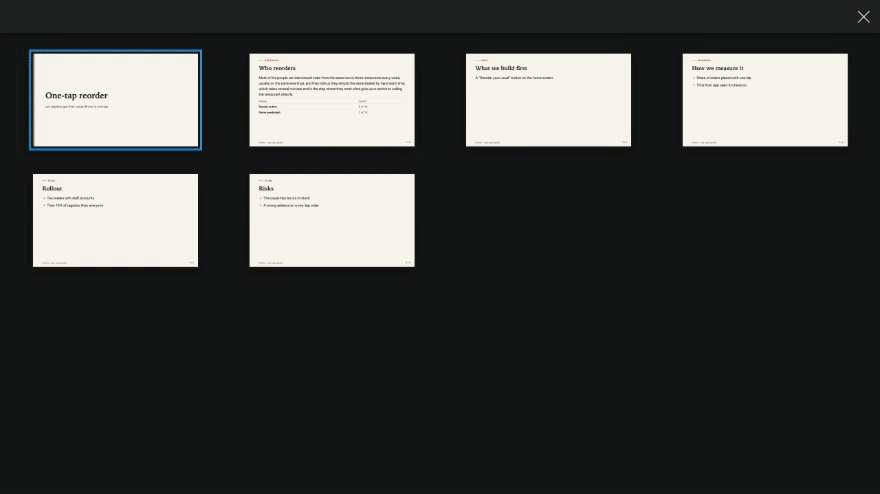
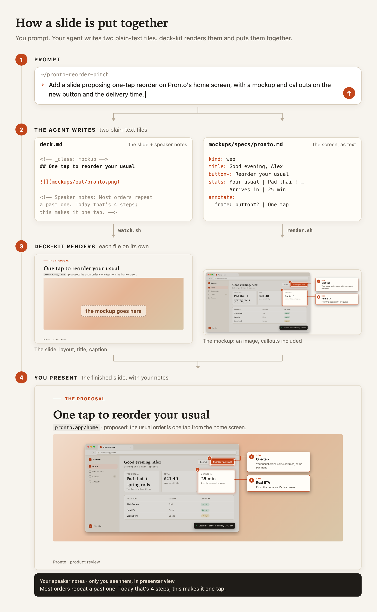
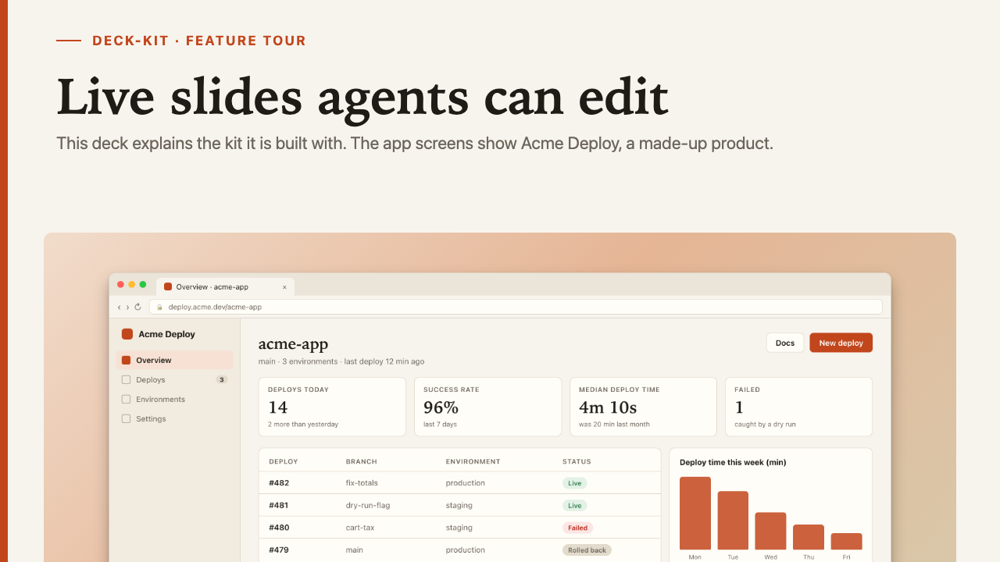
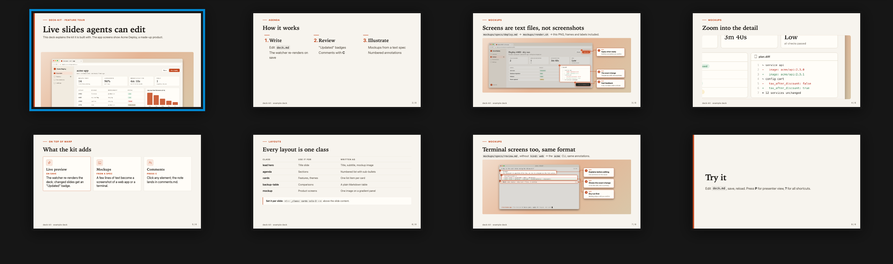
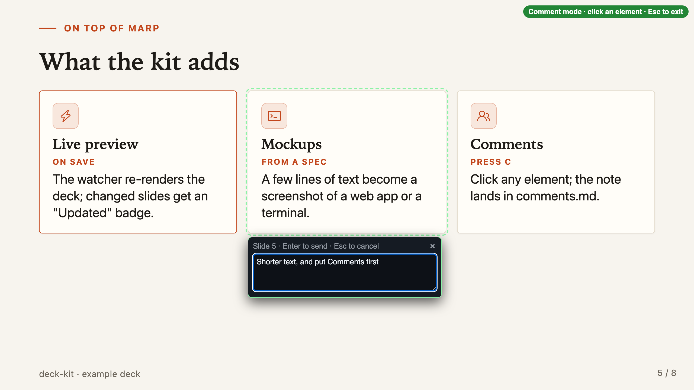
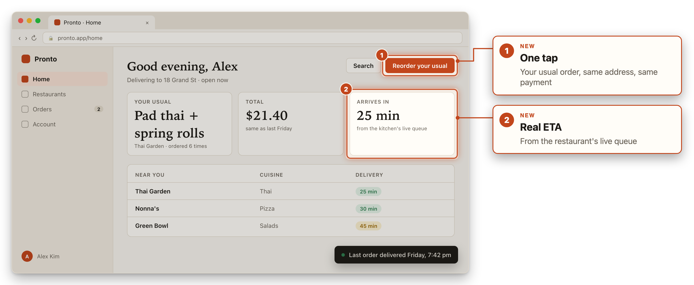
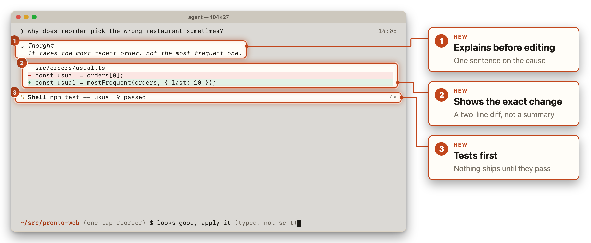
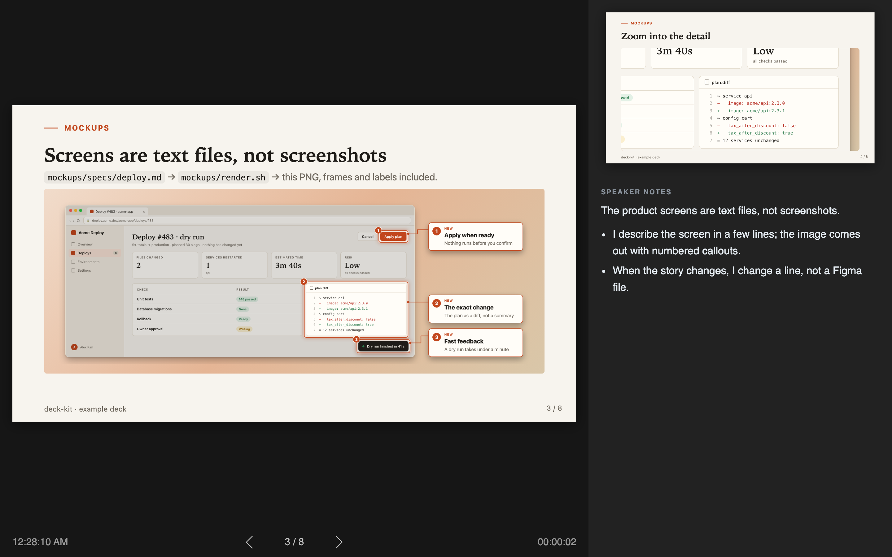

# deck-kit

**Create slides, product mockups and talk track in one agent session.**

A product presentation is three things that have to stay in sync: the narrative, the slides and the product screens. They usually live in three places: a chat with your AI, a slide app and a design tool. deck-kit keeps them in one folder your coding agent can edit. It writes the slides, the product screens and the speaker notes as plain files; you review them in the browser and point at what to change. It's built on [Marp](https://marp.app), which renders the slides; deck-kit adds the text-based mockups, the live review loop and the process the agent follows, from brief to export.



**[▶ Try the live example deck](https://sguyon.github.io/deck-kit/)**: arrows to move, **O** for the overview, **T** and **D** for themes.

## Quick start

You need [Node.js](https://nodejs.org) 18 or newer, Python 3, and a coding agent. Tested on macOS.

**With your agent** (the easy way): paste this into Claude Code, Codex or any coding agent, from any folder.

```text
Clone https://github.com/sguyon/deck-kit into ./deck-kit, read its AGENTS.md, follow the Setup steps, and open the example deck in my browser.
```

It installs what's needed, starts the live preview and the comment server, and opens the deck.

**By hand:**

```bash
git clone https://github.com/sguyon/deck-kit && cd deck-kit
npm install                                      # Marp CLI + Playwright
npx playwright install chromium-headless-shell   # once, for screenshots and mockups
./watch.sh                                       # re-renders the deck on every save
python3 comment-server.py &                      # receives your comments
open deck.live.html
```

Then replace the example `deck.md` with your own, or ask your agent to.

| Key | Action |
|---|---|
| ← → | previous / next slide |
| O | overview of every slide |
| P | presenter view |
| C | comment on an element |
| T / D | switch theme / dark and light |
| F | fullscreen (or the round button, top right) |
| ? | all shortcuts |

Add `?present` to the address to hide every helper while you present.

## How to use it

Open the folder in your coding agent (Claude Code, Codex, Cursor…) and work in two windows: the agent, and the live deck in your browser. The example follows Pronto, a made-up food-delivery app, and a proposal to add one-tap reorder to its home screen.



1. **Brief it.** The problem, the audience, the time limit, what they'll judge.
   > *"I need a 5-minute pitch for Pronto's head of product: add a one-tap 'Reorder your usual' button to the home screen. They care about repeat orders and checkout drop-off, and they'll ask what it costs to build. Draft `deck.md`: one idea per slide, speaker notes under each."*
2. **Shape the outline.** Ask for the structure before the words.
   > *"Go problem → who reorders → the proposal → what it changes → metrics → rollout. Six slides; put the repeat-order numbers on their own slide."*
3. **Describe the screens.** Mockups are text specs, so ask for them like slides.
   > *"Add a mockup of the new home screen: a greeting, the usual order, the delivery time, and a Reorder button. Number the button and the delivery time."*
4. **Review in the browser.** Press **C**, click what's wrong, type a short note. The agent picks it up and applies it; changed slides get an "Updated" badge.
   > *"bigger button"* · *"move the metrics before the rollout"* · *"too much text, split it"*
5. **Let it check its work.** The agent reviews the slides it changed and fixes the layout before it tells you it's done.
   > *"Check slides 3–4 in both themes and fix anything that overflows."*
6. **Rehearse and ship.** Press **P** for presenter view with your notes and a timer, then export to PDF or HTML.
   > *"I ran it and it's 7 minutes. Cut to 5: tell me which slide to drop and trim the notes."*

## What you get

**A live deck.** Every save shows up in the browser, and the slides that changed are flagged. The whole deck is one HTML page: **O** shows every slide at once.





**Comments on the slide itself.** Click any element and type a note. It goes to a file your agent reads and applies, so you don't paste screenshots into a chat.



**Product screens from a description.** A web-app page or a terminal session, described in a few lines, with numbered callouts. Change a line, get a new image; no design tool.





**Presenter view.** Your notes, the next slide and a timer. The agent keeps the notes in step with the slides.



**Two themes, each in light and dark,** with quiet transitions: a short fade, titles that stay put, and a zoom from a screen into its detail. Ask your agent to [adjust them](https://marpit.marp.app/theme-css), or use any existing [Marp theme](https://github.com/marp-team/marp-core/tree/main/themes).

| | light | dark |
|---|---|---|
| **paper** |  |  |
| **terminal** |  |  |

## Why I built it

I built deck-kit while preparing a product case presentation with Claude Code. I wanted the slides, the product mockups and the talk track in one folder the agent could edit, and I wanted to review them the way I review a UI: by pointing at what's wrong. The comment mode, the text mockups and the automatic checks came out of that work.

**What it isn't:**
- A collaborative editor: it's one person and their agent, working in a folder.
- A design tool: the mockups illustrate a product idea; they're not a design system.
- For every browser: the transitions need a recent Chrome, Edge, Safari or Firefox; older ones just switch slides.


**Next feature ideas:**
- Render the mockups as HTML directly in the page, to skip the PNG rendering step.
- Animate the mockups and make them interactive, possibly with [HyperFrames](https://github.com/heygen-com/hyperframes).
- Estimate the talk time from the speaker notes, per slide and in total, against your time limit.
- Phone mockups, next to the web-app and terminal ones.
- Send each comment to the agent the moment you press Enter, instead of the agent watching a file.
- Check the layout automatically on every save: text that overflows, titles that wrap, content too close to the edge.
- Let teammates review a shared copy of the deck with the same comment mode.
- Generate a theme from a company's colors and fonts.
- Export to Google Slides or PowerPoint with editable text. Marp's PowerPoint export is images by default; its editable mode is still experimental.

## Reference

How it works under the hood, every layout class, the mockup spec format, the comment loop and the scripts: [docs/reference.md](docs/reference.md). Your agent reads it for you.

Built on [Marp](https://github.com/marp-team/marp-cli) (MIT). Terminal theme colors from [GitHub Primer](https://github.com/primer/primitives) design tokens (MIT); icons from [Octicons](https://github.com/primer/octicons) (MIT, see `assets/icons/LICENSE-octicons.txt`); screenshots with [Playwright](https://playwright.dev) (Apache-2.0).

Made by [Sacha Guyon](https://guyon.dev). MIT license.
