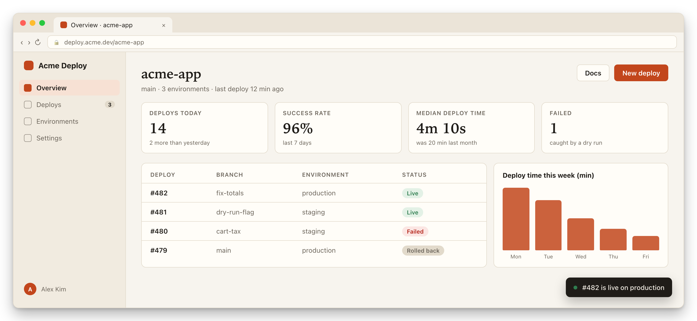
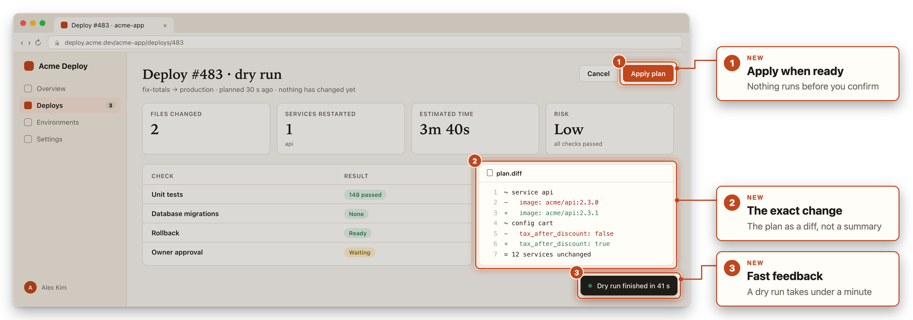
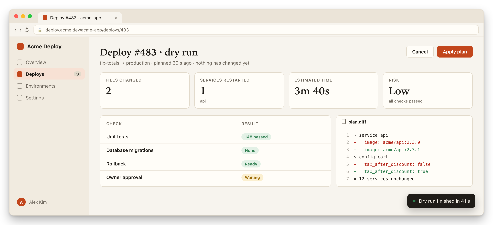

<!-- _class: lead hero -->
<!-- _header: 'deck-kit · Feature tour' -->
<!-- _paginate: false -->

# Live slides agents can edit

This deck explains the kit it is built with. The app screens show Acme Deploy, a made-up product.

<!-- Speaker notes: This slide uses the `lead hero` classes: kicker (the _header), big title, subtitle, and a mockup on a panel that bleeds off the bottom. Every mockup in this deck shows Acme Deploy, a made-up product used as the example: its web dashboard (this one, from mockups/specs/overview.md) and its acme CLI. -->

---

<!-- _class: agenda -->
<!-- _header: 'Agenda' -->

## How it works

1. **Write**
   - Edit `deck.md`
   - The watcher re-renders on save
2. **Review**
   - "Updated" badges
   - Comments with **C**
3. **Illustrate**
   - Mockups from a text spec
   - Numbered annotations

<!-- Speaker notes: The agenda class lays out an ordered list as three columns. Keep each group to two or three short bullets. -->

---

<!-- _class: mockup -->
<!-- _header: 'Mockups' -->

## Screens are text files, not screenshots

`mockups/specs/deploy.md` → `mockups/render.sh` → this PNG, frames and labels included.

<!-- Speaker notes: The `mockup` class puts one image on a gradient panel. The numbered frames come from the `annotate:` block in the spec. Change a line, re-run render.sh, and the image updates. This one is Acme Deploy's dry-run page; the spec starts with `kind: web`. -->

---

<!-- _header: 'Mockups' -->

## Zoom into the detail

<!-- Speaker notes: A close-up of the previous slide's mockup. The 
 wrapper makes the live preview zoom from the previous slide's panel into this point (see README, Transitions). -->

---

<!-- _class: cards cols-3 hero-first -->
<!-- _header: 'On top of Marp' -->

## What the kit adds

-  **Live preview** *On save* The watcher re-renders the deck; changed slides get an "Updated" badge.
-  **Mockups** *From a spec* A few lines of text become a screenshot of a web app or a terminal.
-  **Comments** *Press C* Click any element; the note lands in comments.md.

<!-- Speaker notes: Cards: one list item per card. An icon image first becomes a tinted tile; **bold** is the title, *italic* is the small status line. `hero-first` gives card 1 an accent border. -->

---

<!-- _class: backup-table -->
<!-- _header: 'Layouts' -->

## Every layout is one class

| Class | Use it for | Written as |
|---|---|---|
| **lead hero** | Title slide | Title, subtitle, mockup image |
| **agenda** | Sections | Numbered list with sub-bullets |
| **cards** | Features, themes | One list item per card |
| **backup-table** | Comparisons | A plain Markdown table |
| **mockup** | Product screens | One image on a gradient panel |

> **Set it per slide:** `<!-- _class: cards cols-3 -->` above the slide content.

<!-- Speaker notes: Plain Markdown tables pick up the theme: muted mono header, bold first column, row rules only. The README lists every class, including quote, journey, metrics and opps. -->

---

<!-- _class: mockup -->
<!-- _header: 'Mockups' -->

## Terminal screens too, same format

`mockups/specs/review.md`, without `kind: web` → the `acme` CLI, same annotations.

<!-- Speaker notes: Same made-up product, its CLI side. Specs without `kind: web` go to tools/render.py and come out as terminal screens: paper style is a plain shell, copilot style is a CLI-assistant screen. -->

---

<!-- _class: lead note -->

# Try it

Edit `deck.md`, save, reload. Press **P** for presenter view, **?** for all shortcuts.

<!-- Speaker notes: Speaker notes are HTML comments that start with "Speaker notes:". Run ./speaker-notes.sh to collect them into speaker-notes.md for rehearsal. -->
